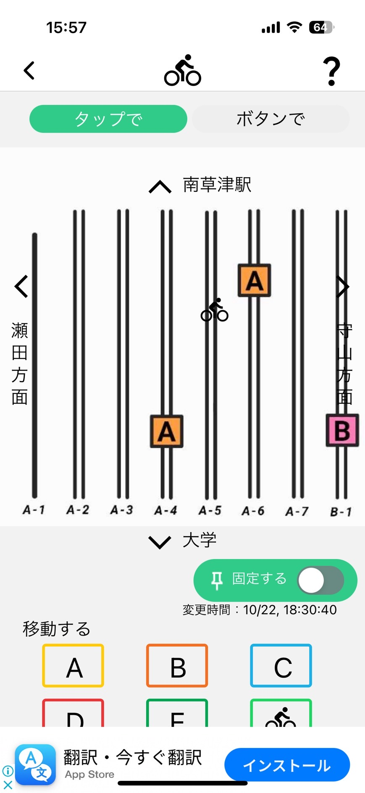
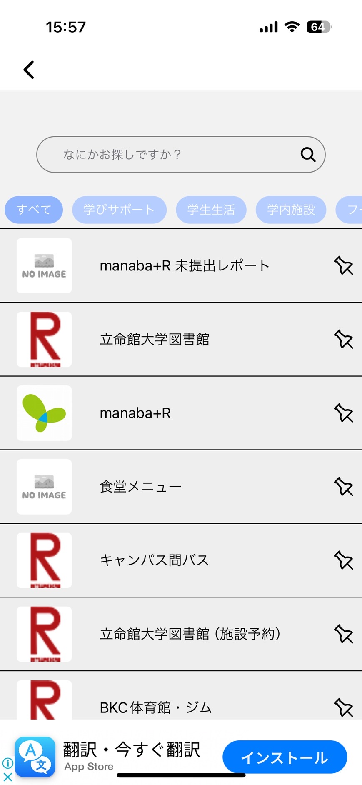

## 概要
 使用したフレームワークや技術は以下の通りです。
 言語：TypeScript
 フレームワーク：Next.js
 ライブラリ：React
  このウェブアプリは自分が学んできたことを示すものであり、今後自作ウェブアプリを作るたの練習台のようなものです。
  このウェブアプリはメモアプリとなっており、メモの追加、編集、削除ができます。また、リロードしても消えないようにLocalStorage内に保存されます。メモの下にはTo-Doリストを作りました。To-Doリストは追加した項目ごとにチェックボックスが現れ、クリックすることで項目の内容が達成できたか示すことができます。また、To-Doリストは全項目の削除が一つのボタンでできます。

## リンク
https://memo-app-2.vercel.app/

## 他のプロジェクト
私は、ArukuArupakaというサークルでアプリ開発に関する知識を学んできました。下の画像は「歩くアルパカ＋R」というアプリの自分の担当した画面となっております。

 私が担当したのは、駐輪場の画面とリンク一覧の画面です。駐輪場の画面は、マップ上に押した箇所に自転車のアイコンが表示され、固定ボタンでアイコンを固定できます。また、いつアイコンを押したのか表示され、下のアルファベットを押すことで、自動的にマップのアルファベットの箇所に移動できます。リンク一覧の画面では、立命生が良く使うサイトを表示しており、カテゴリーごとに飛べるサイトを設定しております。また、サイトはアプリ内で表示されます。さらに、右のピンマークを押すことでサイトを一番上に固定できます。
